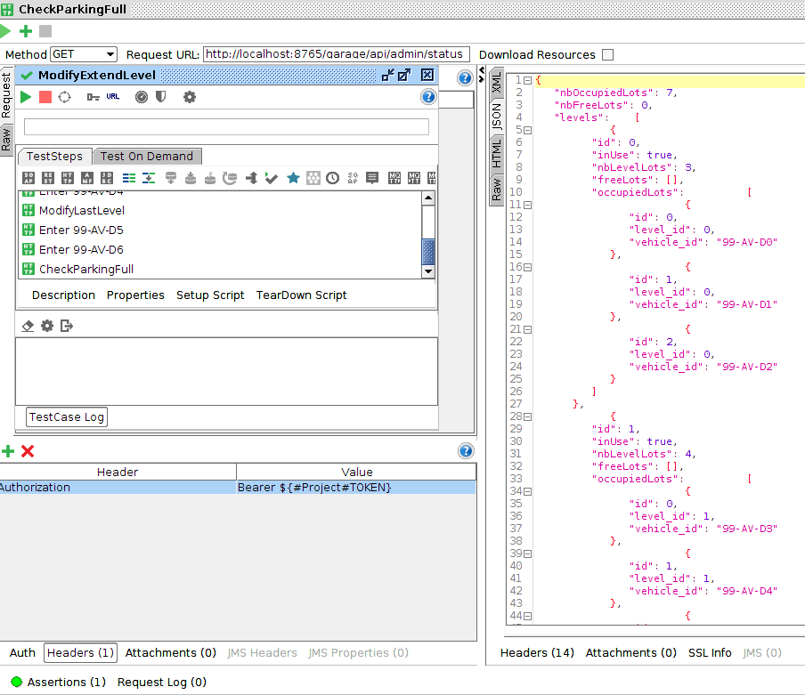
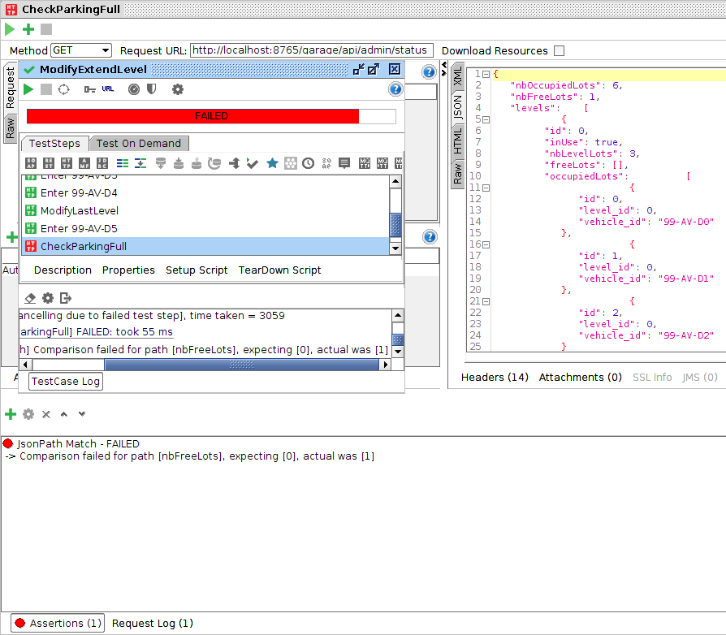
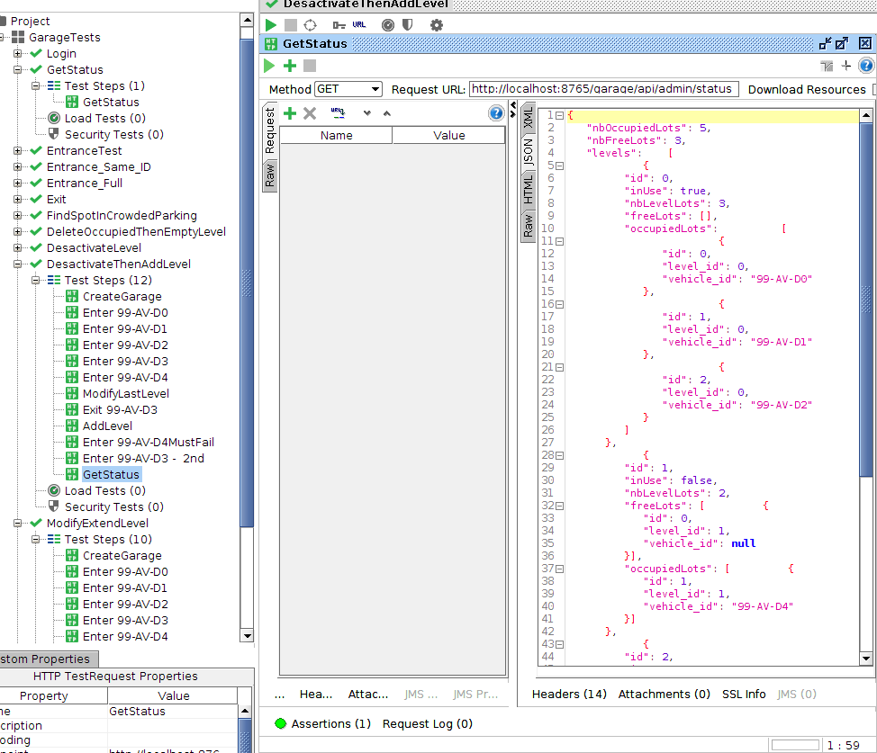

# Garage API microservice

## Intro

This service is the exposed API facade for the Garage Project, it takes the clients requests and forwards that to the core, it also takes the core answers and sends it back to the client.

## Facade details

{endPoints=[

{[/api/clients/gate/{pRegistration_id}],methods=[DELETE],produces=[application/json]}, 

{[/api/clients/find/{pRegistration_id}],methods=[GET],produces=[application/json]}, 

{[/api/management/status],methods=[GET],produces=[application/json]}, 

{[/api/admin/build/garage],methods=[POST],consumes=[application/json]}, 

{[/api/admin/build/garage],methods=[DELETE]}, 

{[/api/admin/build/level],methods=[POST],consumes=[application/json]}, 

{[/api/admin/build/level/{level_id}],methods=[PUT],consumes=[application/json]}, 

{[/api/admin/build/level],methods=[DELETE]}, 

{[/api/]}, 

{[/api/clients/gate],methods=[POST],consumes=[application/json],produces=[application/json]}, 

{[/endpoints],methods=[GET]}, 

{[/error],produces=[text/html]}, 

{[/error]}

]}

Full Swagger Documentation can be visible at this URL when deployed : http://localhost:8765/garage/swagger-ui.html#/

## Security

As for this demo project, the /api/admin/** endpoints are secured with OAuth2 authentication, you need a valid Token to access the service. The OAuth2 workflows have not all been implemented at a state of the art level as it's out of scope for the current task.

The Auth service supports the following workflows : Authorization Code Grant, Implicit Grant, Resource Owner Password Credentials Grant, Client Credentials Grant.

Validated call to get a token from the auth service is : 

- Resource Owner Password Credentials Grant

''curl -s acme:acmesecret@localhost:9999/uaa/oauth/token  \
 -d grant_type=password \
 -d client_id=acme \
 -d scope=management \
 -d username=user \
 -d password=password | jq .''

- Implicit Grant

''http://localhost:9999/uaa/oauth/authorize? response_type=token& client_id=acme& redirect_uri=http://example.com& scope=management& state=65452''

## Documentation

Accessible at http://localhost:8765/garage/api/swagger-ui.html#/ and http://localhost:8765/garage/api/admin/swagger-ui.html#/ (Auth required) once properly deployed.

## Example calls

Please see SOAP UI test to see example calls

For example, the test "ModifyExtendLevel" gives the following status : 

If we move the check one rank up, it fails expecting no free lot while 1 is available : 

If a level is deactivated but cars are still present, their lot will be counted in the total lot number until they exit, then the previously occupied lot will not be counted in the total number of lots anymore.

Example calls:

- Authenticated call : curl http://localhost:8765/garage/api/admin/status

Answer: 

{
   "nbOccupiedLots": 7,
   "nbFreeLots": 0,
   "levels":    [
            {
         "id": 0,
         "inUse": true,
         "nbLevelLots": 3,
         "freeLots": [],
         "occupiedLots":          [
                        {
               "id": 0,
               "level_id": 0,
               "vehicle_id": "99-AV-D0"
            },
                        {
               "id": 1,
               "level_id": 0,
               "vehicle_id": "99-AV-D1"
            },
                        {
               "id": 2,
               "level_id": 0,
               "vehicle_id": "99-AV-D2"
            }
         ]
      },
            {
         "id": 1,
         "inUse": true,
         "nbLevelLots": 4,
         "freeLots": [],
         "occupiedLots":          [
                        {
               "id": 0,
               "level_id": 1,
               "vehicle_id": "99-AV-D3"
            },
                        {
               "id": 1,
               "level_id": 1,
               "vehicle_id": "99-AV-D4"
            },
                        {
               "id": 2,
               "level_id": 1,
               "vehicle_id": "99-AV-D5"
            },
                        {
               "id": 3,
               "level_id": 1,
               "vehicle_id": "99-AV-D6"
            }
         ]
      }
   ]
}

- Unauthenticated call :  curl http://localhost:8765/garage/api/admin/status

{"error":"unauthorized","error_description":"Full authentication is required to access this resource"}